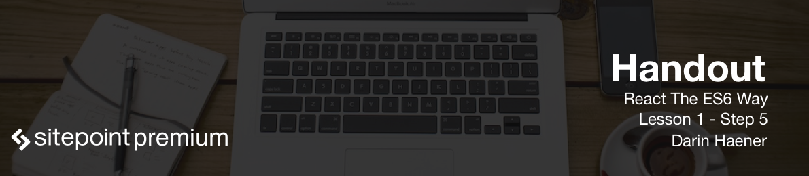

# Application Structure

In this short lesson we'll be creating a few folders and files that will be necessary for us to get going on our application development.

## Example App Files

Let's create all the structure we need to get our example application going. First we'll need our main HTML page that our React component is going to mount to. Inside of the `example` directory create a file called `index.html` and paste in this code:

```html
<html>
  <head>
    <title>React Reading Time Example</title>
    <link href="//maxcdn.bootstrapcdn.com/bootstrap/3.2.0/css/bootstrap.min.css" rel="stylesheet">
  </head>
  <body>
    <div class="container">
      <div id="react"></div>
    </div>
    <script src="/react-reading-time.js"></script>
  </body>
</html>
```

We're doing a few things here. First we're just pulling in BootStrap to give us some easy to use styling. Next you'll notice we have a `div` with an id of `react` on it. This is the container that we are going to use to mount our React app in.

The next thing I want to point out is the script tag at the bottom of the file. This is where our transpiled React code gets loaded. It's being loaded directly from the hot development server that we've setup. If you look into the `webpack.config.js` file you can see on line 6 we have set it up to output the contents of our build to `localhost:8881` and further down in the file we're telling Webpack to use the keys of the entry objects as the file name. So our output file will be called `react-reading-time.js`.

Next we just need to make a directory to hold all of our source files for this mini application:

```bash
$ mkdir src
```

## Config files

We'll need one more configuration file to tell Babel which presets to use when transpiling our ES6 and JSX. Create a new file called `.babelrc` in our applications root folder and put the following in it:

```javascript
{
  presets: ['es2015', 'react', 'stage-0']
}
```

## Testing it out

You can now fire up the development server again and test this small piece out!

```bash
$ npm start
```

Go ahead and visit `localhost:8881/example`. It's not much, just an empty page, but we now have the skeleton we need to get started!
