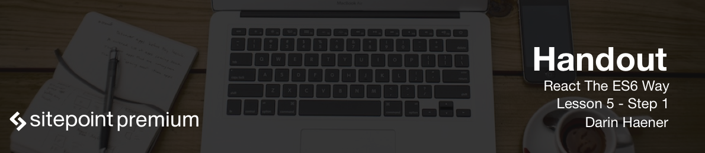

# Course Conclusion

Congratulations! You've finished the ReactJS the ES6 way course!

You're now ready to take on the world and start writing declarative, composable ReactJS applications using all of the great new ES6 features.

* We installed Node and NPM
* We learned how to setup a basic Webpack configuration
* We learned how to setup and start a Webpack development server
* We learned about quite a few new ES6 operators and shortcuts like destructuring, spread operators, and static constructors.
* We then learned how to create React components using ES6 classes, and how to use props and state.
* We learned how React uses the Virtual DOM to make webpages dynamic and incredibly fast.

This was a great introduction, but now it's time to get out there and learn even more about React. I would suggest you look into the following topics to further increase your knowledge of React:

* The Flux architecture
* Implementations of Flux like Alt and Redux
* The Relay framework for declarative data fetching

I've added a few links in the resources section below that will help you continue learning. Thanks for taking this journey with me, and have fun creating application using ReactJS!
